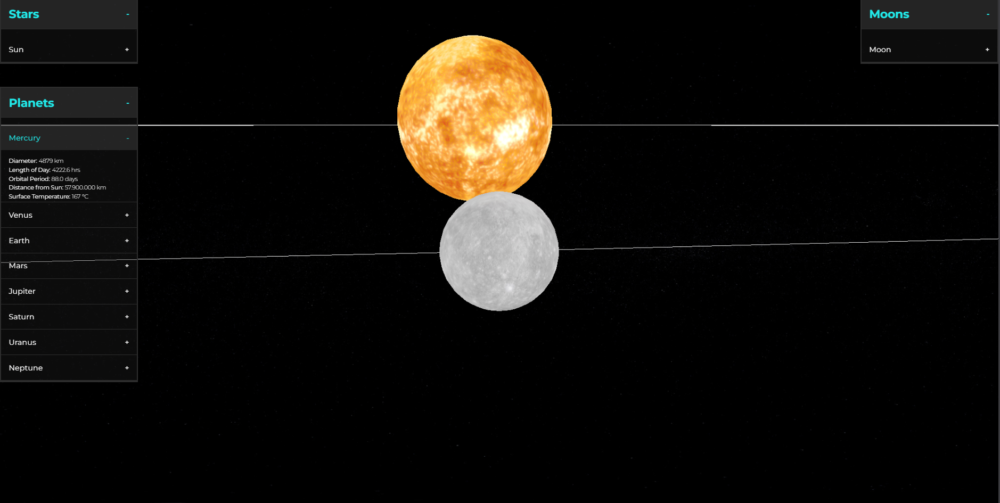

# 🎓 ☀️ Three Space 3D

Interactive model of the Solar System on <b>Three.js</b><br>
🌍 Visualization of orbits, planetary rotations, and reference information about each planet.


## 📷 Demo


Try project online:  
[](https://acidless.github.io/three-space)

## 🚀 Features

- 🌌 Structure of the Solar System in 3D
- 🪐 Animation of planets rotating around their axes and the Sun
- 🔍 Click on a planet to display information about it
- 🌗 Realistic textures (NASA) and scaled sizes
- 🎛️ Camera control (zoom, rotation, focus)

## 🛠 Installation

```bash
git clone https://github.com/acidless/three-space.git
cd three-space
npm install
npm run dev
```

## 📝 License

This project is distributed under the MIT license.
